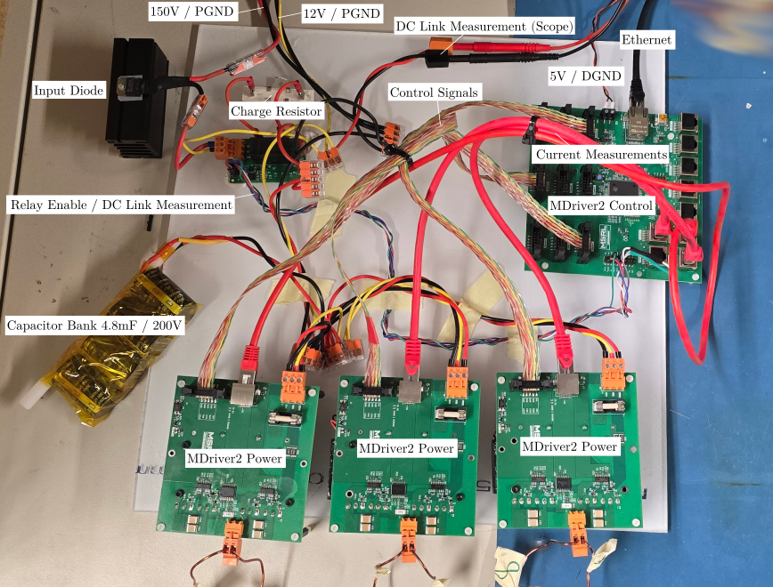
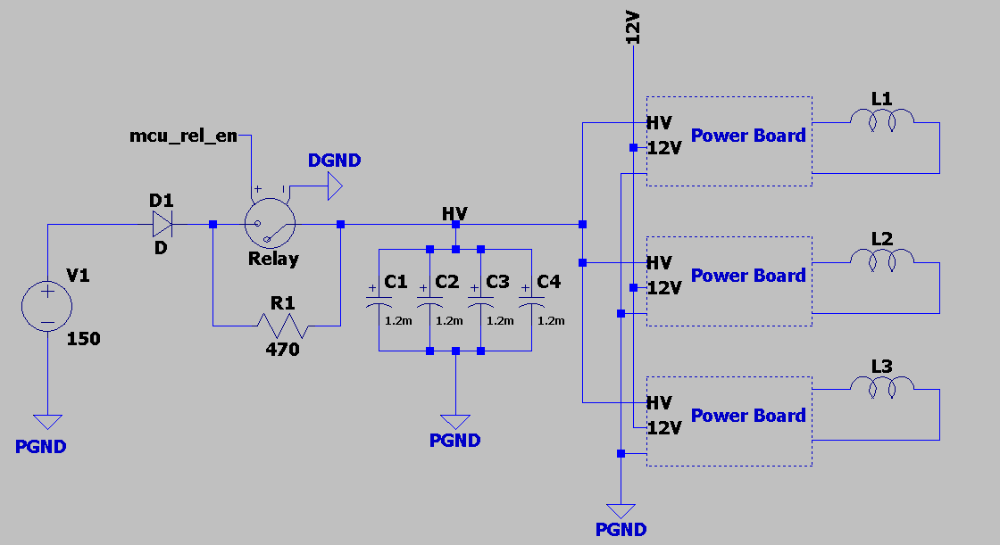

# MDriver2 Hardware
This repository contains the hardware design files of the `MDriver2` project.
## Control Hardware

## Power Hardware

## Experimental Setup Overview

- The input diode `D1` is optional and used to protect the supply `V1`.
- The charge resistor `R1` is used to limit excessive inrush current to the capcacitor bank but may not be needed for all supplies.
- The DC link voltage `VH` is monitored using an isolated DC measurement from the `capbank` PCB. Voltage values are transmitted via delta-sigma modulation to the microcontroller.